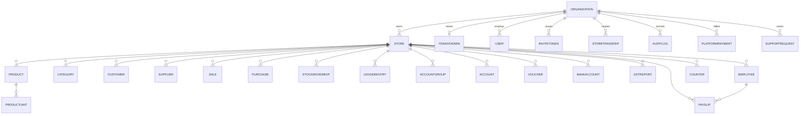
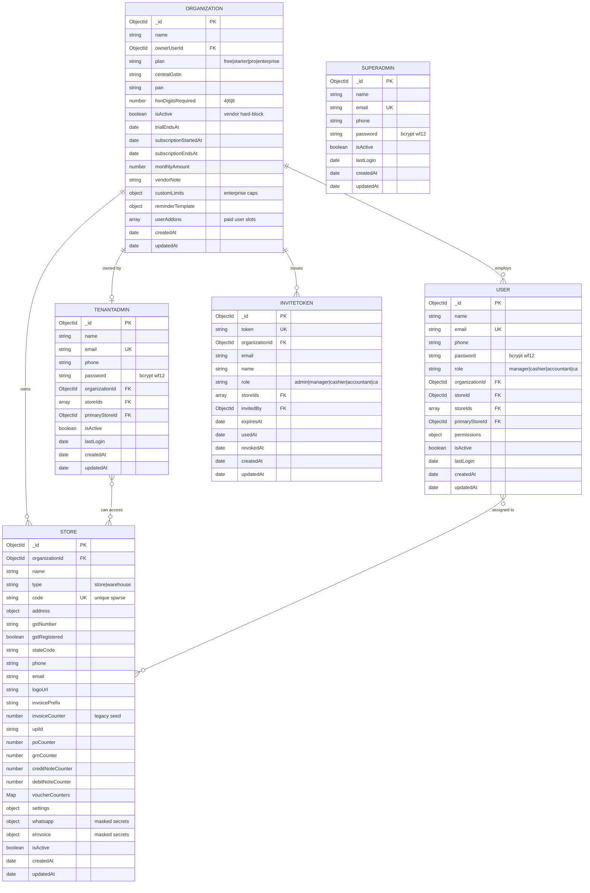
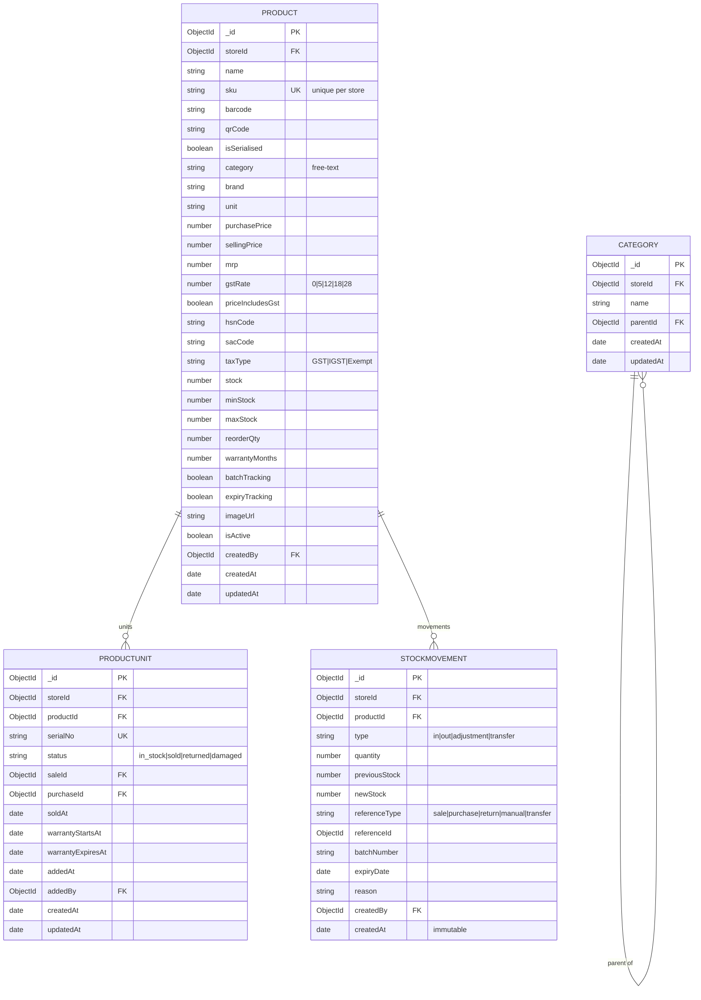
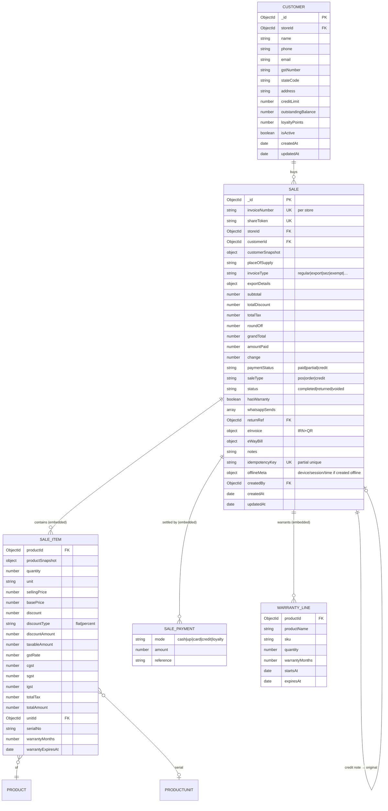
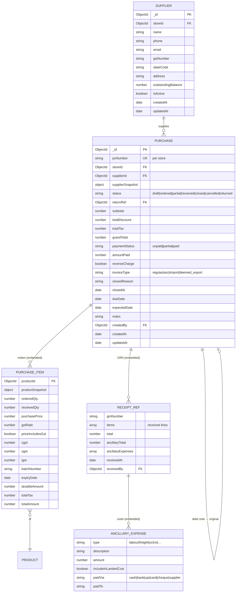
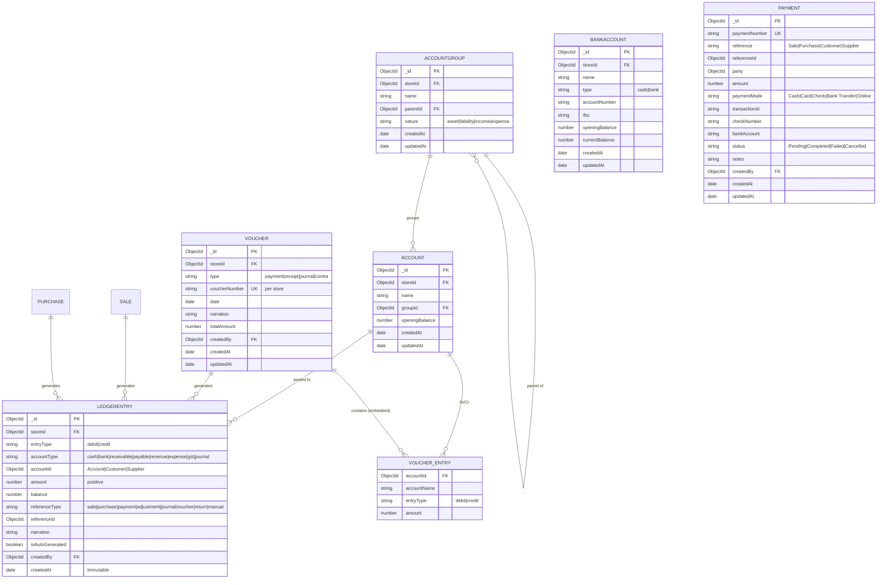
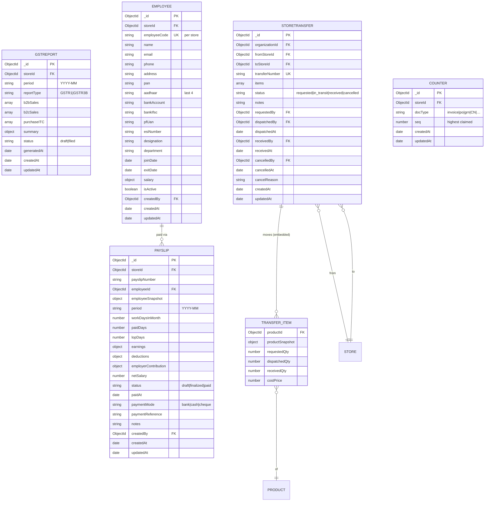
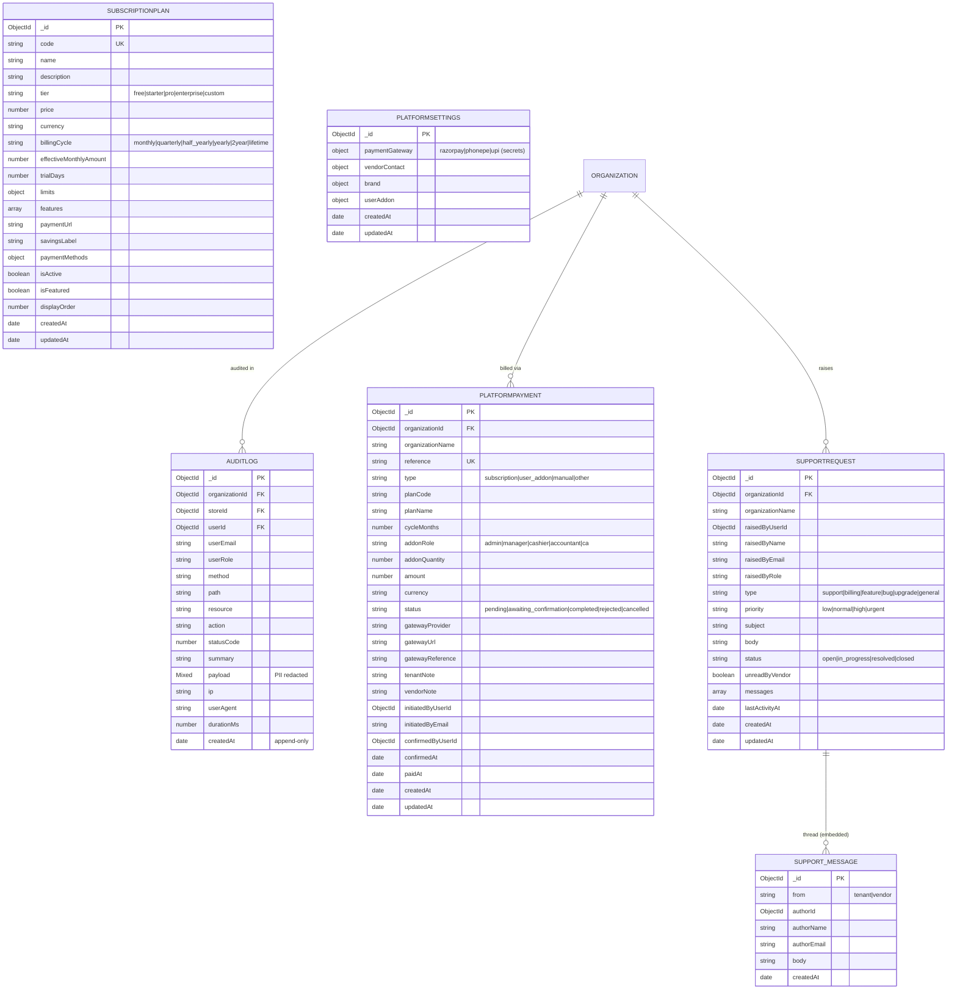

# Database Schema — Visual ER Diagrams (complete)

**Companion to** [database-schema.md](database-schema.md) (prose + every index + nested-object internals).
These are **Mermaid** diagrams — they render in GitHub/GitLab and the VS Code Markdown preview (`Ctrl/Cmd+Shift+V`). **Every collection and every top-level field is shown.** Nested sub-objects appear as a single `object`/`array` attribute (their internal fields are expanded in the companion doc, and the heavily-embedded ones — sale items, purchase items, voucher entries — are drawn as their own *(embedded)* entities below).

**Legend:** `||--o{` one→many · `||--o|` one→zero/one · `}o--||` many→one · `}o--o{` many→many · `PK` primary key · `FK` foreign key · `UK` unique.
**Coverage (all 30 collections):** §2 Organization, Store, SuperAdmin, TenantAdmin, User, InviteToken · §3 Product, ProductUnit, Category, StockMovement · §4 Customer, Sale (+items/payments/warranties) · §5 Supplier, Purchase (+items/GRN) · §6 AccountGroup, Account, LedgerEntry, Voucher (+entries), BankAccount, Payment · §7 GSTReport, Employee, Payslip, StoreTransfer, Counter · §8 AuditLog, SubscriptionPlan, PlatformPayment, PlatformSettings, SupportRequest.

---

## 1. High-level map (tenant data plane)



---

## 2. Identity & tenancy — complete fields


*SUPERADMIN is cross-tenant (no org/store link).*

---

## 3. Catalogue & inventory — complete fields



---

## 4. Customers & Sales — complete fields



---

## 5. Suppliers & Purchases — complete fields



---

## 6. Accounting — complete fields


> `PAYMENT` currently has **no `storeId`** and is unused by services (the ledger records payments via `LEDGERENTRY`). Shown for completeness; fix or remove before wiring it up.

---

## 7. GST, Payroll, Transfers, Sequencing — complete fields



---

## 8. Audit & Platform / SaaS — complete fields


*SUBSCRIPTIONPLAN and PLATFORMSETTINGS are vendor-owned, cross-tenant; the tenant app reads them via `/api/public`.*

---

## How to view / export
- **VS Code:** open this file → `Ctrl/Cmd + Shift + V`. For SVG/PNG export, the "Markdown Preview Mermaid Support" extension, or paste a ```mermaid``` block into <https://mermaid.live> → Export.
- **GitHub/GitLab:** renders inline on the file page.

*Field internals of every `object`/`array` (e.g. `store.settings`, `store.whatsapp`, `payslip.earnings`), all indexes, and integrity rules are in [database-schema.md](database-schema.md). Last updated 2026-06-16.*
